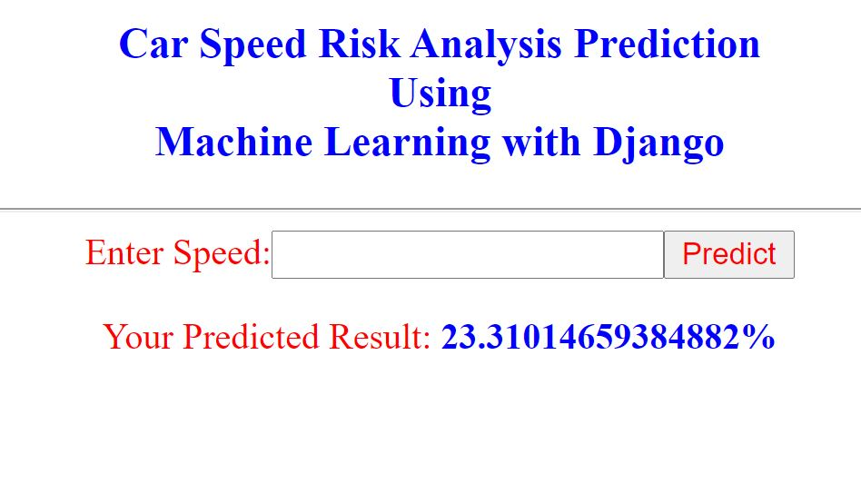

 
  
<h2 align='center'> Car-Risk-Analysis-Using-Django-WIth-ML</h1>

  
Car Speed Risk Analysis Prediction Using Linear Regression Machine Learning with Django

# How to Run this Project

1. First of all install Python version: 3.8 or avobe
2. Now go to the project directory
3. Open cmd go to the Project directory
4. Than you need to install all library from requirements.txt file
> pip install -r requirements.txt

(Note: You need to Internet connection)
5. Now run this command on CMD:
> python manage.py runserver

## Project Screenshort:

 
  
@MehediMK 👋✍

  
Thank you!

